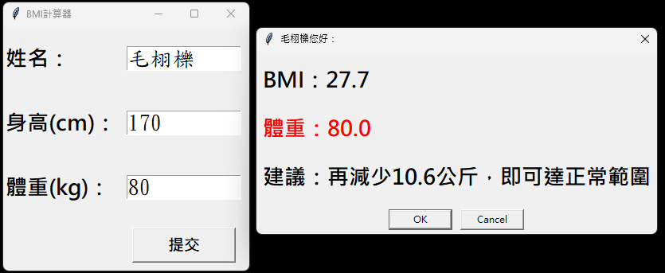

## 作業issue#216  

## 作答
### [BMI程式](./issue216.py)
  
---

## 題目
### 請建立bmi計窗應用程式
[縮圖](https://private-user-images.githubusercontent.com/1614274/337178024-deb16a18-3caa-4520-b65d-6d574ff89b5a.png?jwt=eyJhbGciOiJIUzI1NiIsInR5cCI6IkpXVCJ9.eyJpc3MiOiJnaXRodWIuY29tIiwiYXVkIjoicmF3LmdpdGh1YnVzZXJjb250ZW50LmNvbSIsImtleSI6ImtleTUiLCJleHAiOjE3MTc4NDA2NDIsIm5iZiI6MTcxNzg0MDM0MiwicGF0aCI6Ii8xNjE0Mjc0LzMzNzE3ODAyNC1kZWIxNmExOC0zY2FhLTQ1MjAtYjY1ZC02ZDU3NGZmODliNWEucG5nP1gtQW16LUFsZ29yaXRobT1BV1M0LUhNQUMtU0hBMjU2JlgtQW16LUNyZWRlbnRpYWw9QUtJQVZDT0RZTFNBNTNQUUs0WkElMkYyMDI0MDYwOCUyRnVzLWVhc3QtMSUyRnMzJTJGYXdzNF9yZXF1ZXN0JlgtQW16LURhdGU9MjAyNDA2MDhUMDk1MjIyWiZYLUFtei1FeHBpcmVzPTMwMCZYLUFtei1TaWduYXR1cmU9MDlkMjI0YzZiMjkyNjNiYzU5YTY5MGE4MjE5ZmE5MzcxODZiYzcxN2FmNTYzMWMxMTZjYWE5NTg4Zjk0ZjhmZCZYLUFtei1TaWduZWRIZWFkZXJzPWhvc3QmYWN0b3JfaWQ9MCZrZXlfaWQ9MCZyZXBvX2lkPTAifQ.WxO_EErNZlwwJOST2Sz_5sOXpd2WIIWwWpI1SvKxQjQ)

